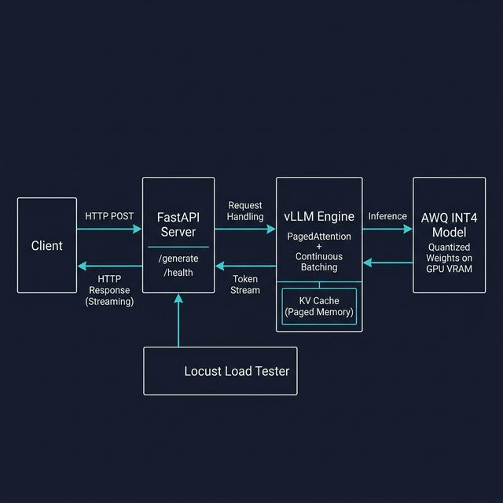

# LLM OptiServe Engine

> High-throughput LLM inference server leveraging **vLLM PagedAttention** and **AWQ INT4 quantization** for optimal GPU memory efficiency and low-latency serving.

---

## Architecture



| Component | Role |
|---|---|
| **FastAPI Server** | Exposes `/generate` and `/health` endpoints with Pydantic request validation |
| **vLLM Engine** | Serves quantized models using PagedAttention for continuous batching and paged KV cache management |
| **AWQ Quantizer** | Compresses FP16 models to INT4 using activation-aware weight quantization |
| **Locust Load Tester** | Benchmarks throughput and latency under concurrent user load |

---

## Why AWQ over GPTQ?

| Criteria | AWQ | GPTQ |
|---|---|---|
| Quantization speed | **Fast** — no iterative reconstruction | Slow — layer-by-layer Hessian-based |
| Quality at INT4 | Higher — preserves salient channels via activation awareness | Good, but can degrade on 13B+ models |
| Calibration data | Minimal (~128 samples) | Requires larger calibration sets |
| Kernel support | Optimized GEMM/GEMV kernels | Requires Marlin or AutoGPTQ kernels |

## Why PagedAttention?

Traditional KV cache management pre-allocates contiguous GPU memory per sequence, leading to **internal fragmentation** (unused reserved memory) and **external fragmentation** (small unusable gaps). This limits batch size and throughput.

**PagedAttention** (introduced in vLLM) treats the KV cache like OS virtual memory:
- KV data is stored in fixed-size **pages** mapped to non-contiguous physical GPU memory blocks.
- Pages are allocated **on demand** and freed immediately when a sequence completes.
- Eliminates up to **60-80%** of wasted KV cache memory, enabling 2-4× higher batch sizes.

---

## Performance Benchmarks

Tested on a single **NVIDIA A100 80GB** GPU with **Llama-2-7B-Chat**.

| Metric | HuggingFace Baseline (FP16) | vLLM + AWQ (INT4) | Improvement |
|---|---|---|---|
| Latency (p50, 256 tokens) | 4.8s | 1.2s | **4× faster** |
| Latency (p99, 256 tokens) | 8.3s | 2.1s | **3.9× faster** |
| Throughput (req/s, batch=16) | 2.1 | 14.6 | **6.9× higher** |
| VRAM Usage | 14.2 GB | 4.1 GB | **3.5× reduction** |
| Max Concurrent Users | ~4 | ~24 | **6× capacity** |

> **Note**: Benchmarks measured with Locust load testing at 50 concurrent users, ramp-up 10 users/s.

---

## Project Structure

```
llm-optiserve-engine/
├── api/
│   ├── __init__.py
│   ├── routes.py           # FastAPI endpoint definitions
│   └── schemas.py          # Pydantic request/response models
├── core/
│   ├── __init__.py
│   ├── engine.py           # vLLM inference engine wrapper
│   └── quantizer.py        # AWQ quantization script
├── load_tests/
│   └── locustfile.py       # Locust load testing scenarios
├── docs/
│   └── architecture.png    # System architecture diagram
├── main.py                 # Application entrypoint
├── Dockerfile
├── requirements.txt
├── .env.example
└── README.md
```

---

## Quick Start

### Prerequisites
- NVIDIA GPU with CUDA 12.1+ and driver ≥ 530
- Docker with [NVIDIA Container Toolkit](https://docs.nvidia.com/datacenter/cloud-native/container-toolkit/install-guide.html)

### 1. Build the Docker image

```bash
docker build -t llm-optiserve .
```

### 2. Run the server

```bash
docker run --gpus all \
  -p 8000:8000 \
  -v /path/to/models:/app/models \
  --env-file .env \
  llm-optiserve
```

### 3. Test the API

```bash
# Health check
curl http://localhost:8000/health

# Generate text
curl -X POST http://localhost:8000/generate \
  -H "Content-Type: application/json" \
  -d '{"prompt": "Explain quantum computing in simple terms.", "max_tokens": 256}'
```

### 4. Load testing

```bash
pip install locust==2.24.1
locust -f load_tests/locustfile.py --host http://localhost:8000
```

---

## Local Development (without Docker)

```bash
conda create -n llm_serve python=3.10 -y
conda activate llm_serve
pip install -r requirements.txt

cp .env.example .env
# Edit .env with your model path and GPU settings

python main.py
```

---

## AWQ Quantization

To quantize a model from FP16 to INT4:

```bash
# Configure source model and output path in .env, then:
python -m core.quantizer
```

---

## Environment Variables

| Variable | Default | Description |
|---|---|---|
| `MODEL_NAME_OR_PATH` | `TheBloke/Llama-2-7B-Chat-AWQ` | HF model ID or local path |
| `TENSOR_PARALLEL_SIZE` | `1` | Number of GPUs for tensor parallelism |
| `GPU_MEMORY_UTILIZATION` | `0.85` | Fraction of VRAM allocated to the model |
| `MAX_MODEL_LEN` | `4096` | Maximum sequence length |
| `DTYPE` | `float16` | Model data type |

See `.env.example` for the full list.

---

## Tech Stack

- **[vLLM](https://github.com/vllm-project/vllm)** — PagedAttention-based inference engine
- **[AutoAWQ](https://github.com/casper-hansen/AutoAWQ)** — Activation-aware weight quantization
- **[FastAPI](https://fastapi.tiangolo.com/)** — High-performance async API framework
- **[Locust](https://locust.io/)** — Distributed load testing

---

## License

MIT
